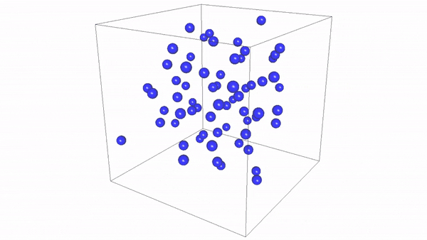

FluidDyn
==========
A parallelized Haskell simulation of the molecular dynamics of liquid argon, using the velocity Verlet algorithm



Getting Started
---------------
```
ghc --make -O2 -threaded FluidDyn.hs
./FluidDyn +RTS -N4
```
