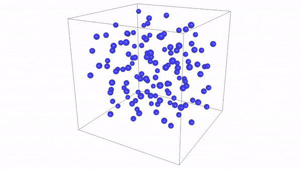

FluidDyn
==========
A parallelized Haskell 3D simulation of the molecular dynamics of liquid argon, using the velocity Verlet algorithm



Getting Started
---------------
To compile and run the program, use the commands:
```
ghc --make -O2 -threaded FluidDyn.hs
./FluidDyn +RTS -N4
```
If you choose to run the "mainNoAnim" function, you can replace the second line with:
```
./FluidDyn +RTS -N4 -s -l
```
to output diagnostics to the command prompt once the program finishes.

You will need the `Control.Parallel`, `not-gloss`, and `Linear`. Run the commands:
```
stack install parallel
stack install not-gloss
stack install linear
```

Test Cases
----------
Various test configurations can be run to explore the limits and speedups of our program. The relevant parameters should be changed directly at the top FluidDyn.hs file. You can choose between two main functions--`mainAnim` or `mainNoAnim`--where the former runs a 3D animation of the physics simulation at 50 frames per second, and the latter runs the simulation for `simLen` timesteps as fast as it can. `mainAnim` is of course more expensive, and in our experience it can only handle up to n=5 (i.e. 125 particles in a 5x5x5 starting grid) when using N=4 cores. `mainNoAnim` can be pushed farther, to a greater number of particles. See our report for details on its performance scaling.

For optimal performance, set the `chunkSize` parameter to `(number of cores)/(number of particles)` in FluidDyn.hs

For our report, we ran all of our test cases using a prior 2D version of the algorithm, using arrays of up to 576 total particles or up to a simLen of 2000 time-steps. Using 4 cores, we achieve up to a 2.5x speedup.
